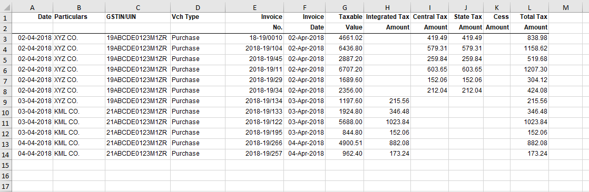
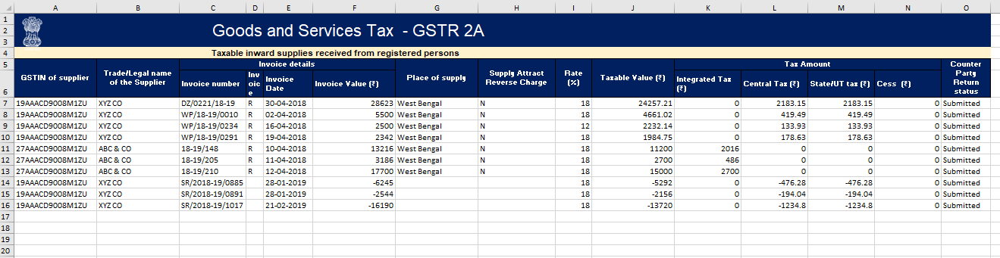
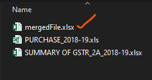
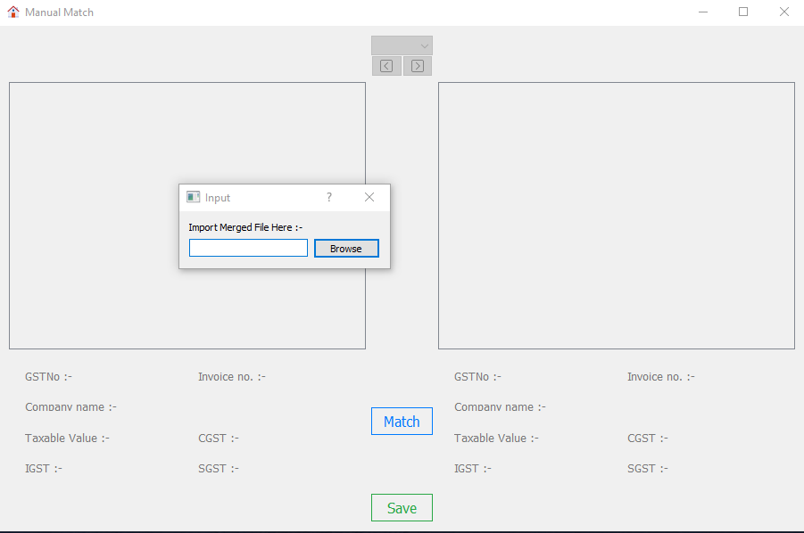
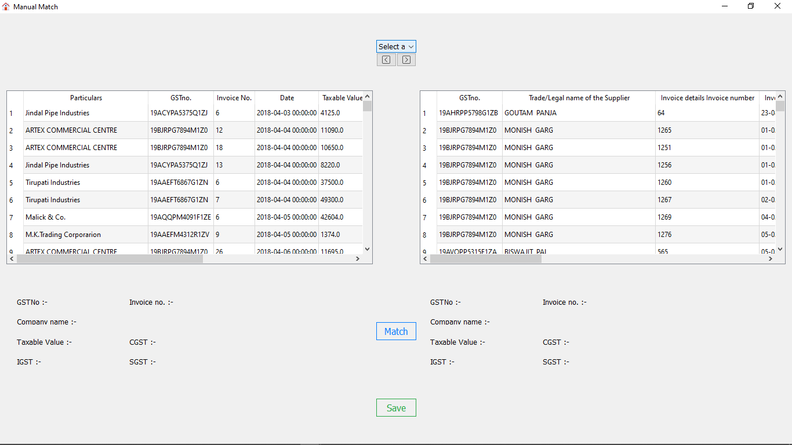
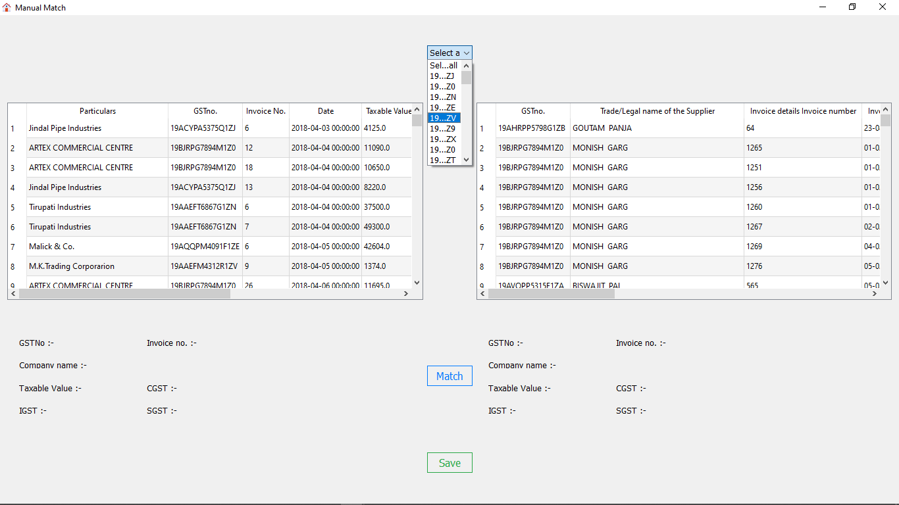
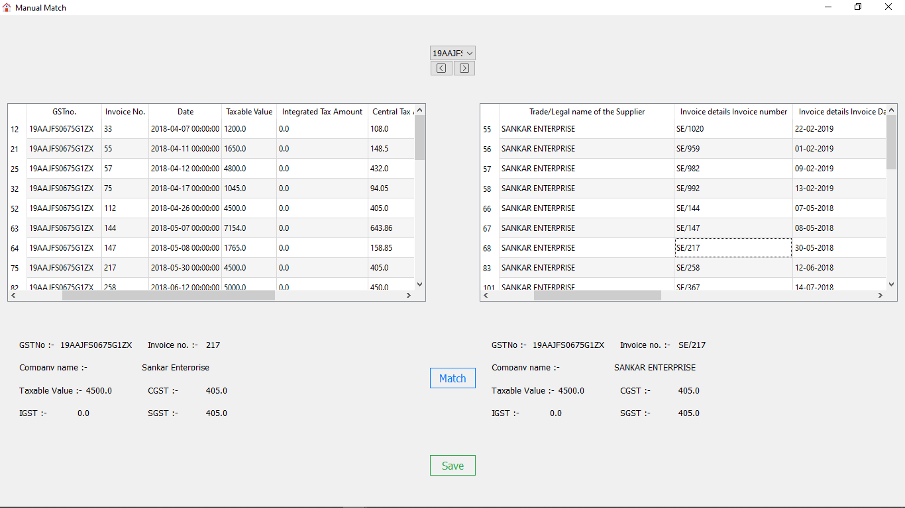
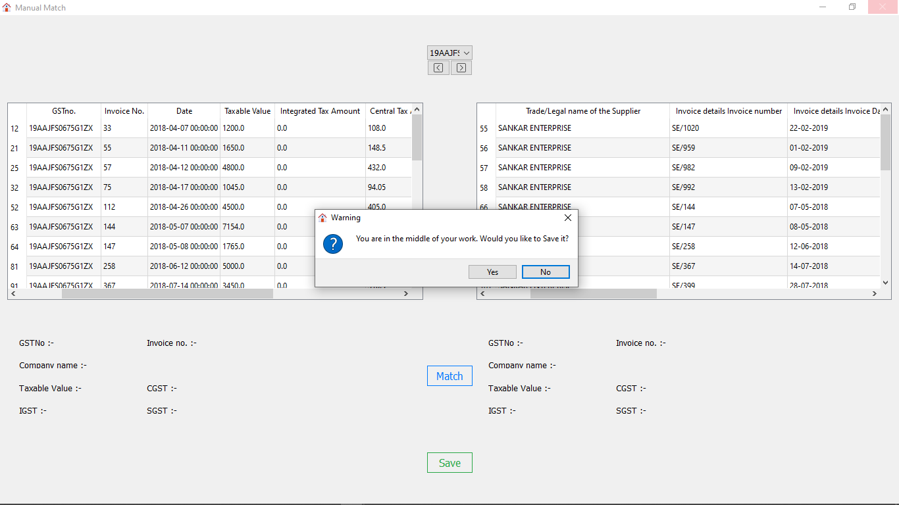

# TallyProject

### TallyProject is a business application for those who struggles to resolve their billing transactions 

To run a business successfully and smoothly, everyone tries to resolve their incoming and outgoing case flow as quickly and simply as possible. But humans are not machine. They have to run on their own speed. 
    Big business make over 1000's of such transaction per week, and get them resolved as the business speeds up, is nearly impossible by humans.

##### This Application will help this situation very easy to control with finding those matches automatically between purchase bills and sales bills. 
    
### Features

This application comes with two executable files :-

* [autoMatche.exe] - for finding matching bills autometically (average 80% accuracy)
* [doMatch.exe]    - for finding matching bills manually, comes with rich GUI

### Installation

>   This application comes with executable binary files.\
>   Doesn't require any sort of installation,\
>   Just download, run and work

### Demo Workflow

##### Data Validation

* Excel File for Purchase side should follow the following format

* Excel File for Sales side should follow the following format

###### Note:
> All of the mentioned excel file templates are available in 'Package' folder,
> You can follow this format to create your own data in the best compatible way

##### The Home page of autoMatch.exe look like:

##### After choosing excel files, it will give a list of sheets available into those excel file. Choice is yours which one to work with

##### Now, you have to choose the rows where the table columns are written

* This image shows my demo excel file, the red box indicates the numbers of rows where table column are written

* These numbers are needed to be written in the "Header" section separated by comma (,)

* After this, press the "Start" button, see the magic:

* Here in the red box, you can see the result along with accuracy and time of Auto Matching.\
* It will create a new file in the same directory

##### The Home page of doMatch.exe look like:

* In this browse filebox, you need to provide the newly created file by autoMatch.exe

* Image of DoMatch work area 

* Filter bar

> Note: Filter bar will help you to filter out table content by GST Number,\
> There are two buttons available : Previous GST no and Next GST no

* Doing manual match

> 1. Click on any row on left side and right side
> 2. Item will update the values on two small boxes
> 3. press the match button
> 4. If the values on the small boxes are equal, then match request will be accepted, and those two row will be deleted
> 5. Otherwise, it will prompt you a message

* Save your result

> Press the save button to save the result,\
> It will update the same file

###### Note:
> If your ongoing task is not saved and you try to close the application,
> It will prompt you with a message to save your work

